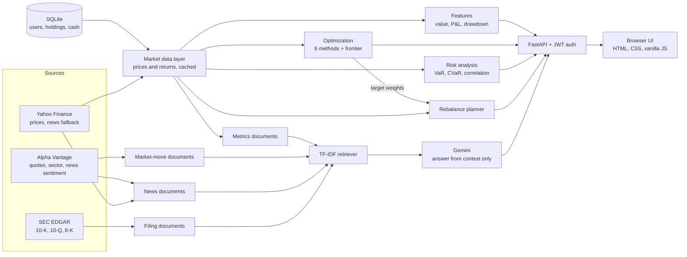

# A Context-Aware System for Professional Portfolio Management

A self-hostable web application that combines **classical portfolio optimization**, **risk analytics**, **rebalancing**, and a **retrieval-augmented question-answering layer** that explains what is happening in a portfolio using the portfolio's own data, market context, news sentiment, and SEC filings.

> **Status:** research prototype / demo. Single demo user, live data from free APIs, no backtesting module. See [Limitations and Known Issues](#8-limitations-and-known-issues) before relying on any output.

---

## Contents

1. [Abstract](#1-abstract)
2. [Quick Start (Reproduce It)](#2-quick-start-reproduce-it)
3. [Using the Application](#3-using-the-application)
4. [System Architecture](#4-system-architecture)
5. [Methods](#5-methods)
6. [Limitations and Known Issues](#8-limitations-and-known-issues)

---

## 1. Abstract

Portfolio tools usually do one of two things: they compute numbers (allocations, risk, performance) or they summarize news. They rarely connect the two. A manager looking at a 4% drop in one holding has to separately check whether the market fell, whether the sector fell, whether there was a headline, and whether the company filed anything with the SEC.

This project puts both halves in one system:

- **Quantitative core.** Six allocation methods (Markowitz mean-variance, minimum variance, maximum Sharpe, risk parity, Hierarchical Risk Parity, and a simplified Black-Litterman), an efficient-frontier sampler, historical-simulation VaR and CVaR, per-asset risk contribution, and a rebalance planner that reports trades, turnover, and estimated cost.
- **Context layer.** A retrieval-augmented generation (RAG) pipeline that turns the user's holdings, intraday moves versus the Nasdaq-100 and sector, news sentiment, and recent SEC filings into short text documents, retrieves the relevant ones for a question, and asks a language model to answer **only from that context**, with hedged causal language.

The goal is not to predict markets. It is to make a portfolio **explainable in one place**.

---

## 2. Quick Start (Reproduce It)

### Requirements

| Item | Needed for | Notes |
|---|---|---|
| Python 3.10 or newer | everything | The code uses `dict \| None` type hints. Tested on 3.13. |
| Internet access | live prices | Prices come from Yahoo Finance via `yfinance`. If it is unreachable, the API returns HTTP 502. |
| Gemini API key | the **Ask** tab | Free keys are available from Google AI Studio. |
| Alpha Vantage API key | market-move context (optional) | Free tier is small. Without it the app still runs; see below. |

### Step 1 — Get the code

```bash
git clone https://github.com/umer-farooq230/A-Context-Aware-System-for-Professional-Portfolio-Management.git
cd A-Context-Aware-System-for-Professional-Portfolio-Management
```

### Step 2 — Create an environment and install dependencies

The repository does not ship a `requirements.txt`, and the `pyproject.toml` in the root belongs to an unrelated command-line tool, so install the dependencies directly:

```bash
python -m venv .venv
source .venv/bin/activate          # Windows: .venv\Scripts\activate

pip install fastapi "uvicorn[standard]" "python-jose[cryptography]" bcrypt python-multipart \
            numpy pandas scipy scikit-learn yfinance vaderSentiment requests \
            google-genai python-dotenv
```

### Step 3 — Set your API keys

The server **will not start** unless `API_KEY` is set, because the Gemini client is created when the app is imported.

```bash
export API_KEY="your-gemini-key"             # required
export ALPHA_VANTAGE_KEY="your-av-key"       # optional
```

On Windows PowerShell use `$env:API_KEY="..."` instead of `export`.

> **About `.env` files:** `rag/qa.py` imports `load_dotenv` but never calls it, so a `.env` file is currently **not** read. Either export the variables as above, or add `load_dotenv()` near the top of `rag/qa.py` (before the `Client(...)` line).

What happens without the optional key:

- Without `ALPHA_VANTAGE_KEY`, the "ticker vs Nasdaq vs sector" documents are skipped. News falls back to Yahoo Finance headlines scored with VADER.
- SEC EDGAR needs no key.

### Step 4 — Run

From the repository root:

```bash
uvicorn backend.main:app --reload
```

Open <http://127.0.0.1:8000> and sign in with the demo account:

| Field | Value |
|---|---|
| Email | `demo@portfolio.io` |
| Password | `Demo@1234` |

The SQLite database (`data/app.db`) is included and is recreated with the demo user and nine holdings if it is missing.

### Step 5 — Enable the Risk Analysis tab (one-line fix)

The risk endpoint is implemented but its route decorator is missing, so the **Risk Analysis** tab currently receives a 404. In `backend/main.py`, add one line directly above `def risk_analysis`:

```python
@app.get("/api/risk")
def risk_analysis(current_user: User = Depends(get_current_user)):
```

### Verify it works

```bash
# 1. Log in and capture a token
TOKEN=$(curl -s -X POST localhost:8000/auth/login \
  -d "username=demo@portfolio.io&password=Demo@1234" \
  | python -c "import sys,json; print(json.load(sys.stdin)['access_token'])")

# 2. Run an optimization (requires live prices)
curl -s -X POST localhost:8000/api/optimize \
  -H "Authorization: Bearer $TOKEN" -H "Content-Type: application/json" \
  -d '{"portfolio":"demo","method":"Hierarchical Risk Parity (HRP)","risk_profile":"Moderate"}'
```

You should get a list of weights, expected return, volatility, Sharpe ratio, and 12 efficient-frontier points. Interactive API docs are at <http://127.0.0.1:8000/docs>.

---

## 3. Using the Application

The web UI has six sections.

| Tab | What it does | Backend route |
|---|---|---|
| **Dashboard** | Portfolio value, day change, P&L, YTD return, annualized volatility, maximum drawdown, 6-month value and drawdown curves | `GET /api/dashboard` |
| **Portfolio** | Holdings, live prices, market value, current vs target weights, allocation by asset class | `GET /api/portfolio/holdings` |
| **Optimize** | Choose a method, risk profile, and weight bounds; see target weights, expected return and risk, and the efficient frontier | `POST /api/optimize` |
| **Rebalance** | Turn the last optimization into buy/sell/hold actions with share counts, turnover, and estimated cost | `POST /api/rebalance` |
| **Risk Analysis** | Annualized volatility, 1-day 95% VaR and CVaR, correlation matrix, risk contribution per holding, return histogram | `GET /api/risk` (see Step 5) |
| **Ask** | Natural-language questions answered from retrieved context, with the source snippets shown | `POST /api/ask` |

Example questions for the **Ask** tab:

- "Why is NVDA down today?"
- "Which of my holdings is the most volatile?"
- "Did any of my companies file anything with the SEC recently?"

The demo portfolio is: AAPL, MSFT, GOOGL, AMZN, NVDA, TSLA, JPM, BTC-USD, ETH-USD, plus a cash balance of 42,110. Holdings live in the `holdings` table and can be changed there.

---

## 4. System Architecture



**Request flow for a typical session:** log in (bcrypt-hashed password, JWT token valid 60 minutes) → the market data layer reads holdings from SQLite and pulls two years of daily prices → each tab calls its endpoint → an optimization stores its target weights in memory so the rebalance planner can use them.

---

## 5. Methods

### 5.1 Data

- **Prices:** two years of daily adjusted closes from Yahoo Finance, forward-filled, then daily simple returns. Results are cached for 60 seconds.
- **Expected returns and covariance:** the historical mean daily return and sample covariance, both multiplied by 252 to annualize. These feed every optimizer.
- **Holdings and cash:** SQLite, seeded with the demo portfolio.

### 5.2 Allocation methods

All methods share the same inputs (expected returns, covariance, weight bounds) and the same constraint that weights sum to one. Constrained methods use SciPy's SLSQP solver. If the solver does not converge, mean-variance, minimum variance, maximum Sharpe, and risk parity fall back to equal weights, and Black-Litterman falls back to the stored target weights.

| Method | Objective | Notes |
|---|---|---|
| **Mean-Variance (Markowitz)** | maximize `return − λ · variance` | λ is set by risk profile: Conservative 6.0, Moderate 3.0, Aggressive 1.2 |
| **Minimum Variance** | minimize portfolio variance | Ignores expected returns |
| **Maximum Sharpe** | maximize `(return − rf) / volatility` | Risk-free rate fixed at 4.5% |
| **Risk Parity** | equalize each asset's share of total risk | Floor of 0.01% per asset |
| **Hierarchical Risk Parity** | cluster by correlation, allocate by inverse variance down the tree | No matrix inversion; bounds applied afterwards by clip and renormalize |
| **Black-Litterman (simplified)** | reverse-engineer market-implied returns from the stored target weights, then optimize | No investor views yet; see limitations |

Alongside the chosen method, the app samples **12 points on the efficient frontier** by minimizing variance at evenly spaced target returns.

### 5.3 Risk analytics

- **Annualized volatility** of the current-weight portfolio.
- **Historical-simulation VaR and CVaR** at 95%, 1-day. VaR is the 5th percentile of the daily portfolio return series; CVaR is the average of returns at or below it.
- **Correlation matrix** across holdings.
- **Risk contribution** per holding: `wᵢ · (Σw)ᵢ / portfolio variance`, which sums to 100%.
- **Return histogram** (24 bins) of the daily portfolio return series.
- **Maximum drawdown** and its peak-to-trough window on the dashboard.

### 5.4 Rebalancing

For each holding the planner computes `target weight − current weight`, converts it to a value and an estimated share count, and labels it BUY, SELL, or HOLD (a band of ±0.1 percentage points counts as HOLD). It reports total turnover and an estimated cost using an assumed 5 basis points on traded value.

### 5.5 Context layer (RAG)

1. **Build documents.** Four kinds of short text records are generated per ticker:
   - *metrics*: annualized volatility, 1-day and 5-day return, target weight, shares held;
   - *market_move*: today's move for the ticker, QQQ (Nasdaq-100 proxy), and the mapped sector;
   - *news*: recent headlines with a sentiment label and score (Alpha Vantage, or Yahoo headlines scored with VADER as a fallback for tickers Alpha Vantage returns nothing for, such as crypto symbols);
   - *filing*: the most recent 10-K, 10-Q, and 8-K filings (up to three per ticker) with links.
2. **Retrieve.** Documents are vectorized with TF-IDF and ranked by cosine similarity to the question. A document gets a 1.5× boost if its ticker is named in the question. The top 8 are kept.
3. **Generate.** The retrieved snippets go to a Gemini model with a system prompt that requires the model to:
   - answer **only** from the provided context;
   - structure a price-move explanation as ticker move → index move → sector move → possible catalyst;
   - use hedged causal language and never assert that a headline caused a move;
   - say plainly when the context is not enough.
4. **Show sources.** The API returns the retrieved snippets with the answer so the user can check them.

Document sets are cached for 5 minutes. Alpha Vantage responses are cached for 6 hours and SEC data for 12 hours to stay inside free-tier limits.

---

## 6. Limitations and Known Issues

Listed plainly so results are interpreted correctly and contributors know where to start.

**Bugs and gaps to fix**

- **`/api/risk` is not registered** (missing decorator). The Risk Analysis tab returns 404 until the one-line fix in [Step 5](#step-5--enable-the-risk-analysis-tab-one-line-fix) is applied. The dashboard also lists the Risk Analysis nav button twice.
- **`.env` is not loaded** (`load_dotenv()` is imported but never called), and the server fails at start-up if `API_KEY` is not exported.
- **No dependency manifest.** The root `pyproject.toml` and the `packaging/` folder describe a different project (`aura-ascii`) and are unrelated to this application.
- **Some request fields are accepted but unused:** `max_sector_exposure`, `target_volatility`, `cash_buffer`, and `portfolio`.
- **`long_only = false` does not produce short positions.** Bounds permit negative weights, but the output step clips negatives and renormalizes.
- **`Features/fundamentals.py`** (`build_features`: multi-horizon returns, downside volatility, momentum, volume ratios) is not called by any endpoint yet.
- The module `data/mock_data.py` is named "mock" but fetches **live** data.
- Benchmark YTD return on the dashboard is a hard-coded placeholder (8.9%).
- The Gemini model name is hard-coded in `rag/qa.py`; confirm it is valid for your API key and change it if not.

**Methodological limits**

- **Expected returns are historical averages**, which are noisy and unstable. Unconstrained mean-variance can concentrate heavily in a single asset, so set a sensible maximum weight when using it.
- **Black-Litterman is the neutral case only.** With no views, the result stays close to the stored target weights (tilted slightly toward lower variance) and does not add independent information.
- **HRP uses single linkage** and applies bounds after the fact, so bounds are approximate.
- **VaR/CVaR are backward-looking** and assume the last two years resemble the future. They use current weights, not the weights held historically.
- **No backtest, walk-forward test, or transaction-cost model beyond a flat 5 bp** is included. Nothing here demonstrates out-of-sample performance.
- **RAG quality depends on source availability.** Free API limits can leave sections of context empty; the model is instructed to say so rather than guess. Language-model output can still be wrong, so check the cited sources.

**Security (demo-grade)**

- The JWT secret is hard-coded (`CHANGE_ME_BEFORE_PRODUCTION`), CORS allows all origins, and the app is single-tenant (one demo login). Do not deploy publicly without changing these.
- The SEC EDGAR request header contains a contact email; set it to your own, as the SEC's fair-access policy requires.

**Not financial advice.** This is a research and educational project.

---


## License

MIT. See [LICENSE](LICENSE).
